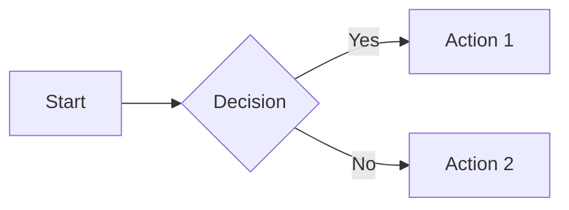

# Share Document

마크다운 파일을 공유용 standalone HTML로 변환한다. 결과물에는 좌측 사이드바 미니맵(목차 + 스크롤 연동 활성 섹션 강조)이 포함된다.

## 의존성

- `pandoc` (설치 확인: `which pandoc`. 없으면 `brew install pandoc`)

## 인자

| 인자 | 필수 | 설명 |
|------|------|------|
| 파일 경로 | Y | 변환할 마크다운 파일의 절대/상대 경로 |
| `--no-open` | N | 변환만 하고 브라우저는 열지 않음 |
| `--depth N` | N | 네비 TOC에 노출할 헤더 레벨 (기본 2, h1~hN까지) |

## Steps

### 1. mermaid → Unicode box-drawing 변환 (LLM 수행)

pandoc은 mermaid 코드블록을 텍스트로만 출력하므로, 입력 마크다운 안의 모든 ```` ```mermaid ```` 코드블록을 LLM이 직접 **Unicode box-drawing 문자**(`─ │ ┌ ┐ └ ┘ ├ ┤ ┬ ┴ ┼ ═ ║ ╔ ╗ ╚ ╝ ╠ ╣ ╦ ╩ ╬ ▶ ◀ ▲ ▼`, U+2500~U+257F)로 그린 ASCII 다이어그램으로 교체한다.

**변환 원칙:**
- 원본 mermaid 블록은 ```` ``` ```` (언어 지정 없음) 코드 펜스로 교체. monospace 폰트 유지
- 노드 = 박스(`┌─ ─┐ │ └─ ─┘`), 결정/분기 = 더블 라인(`╔═ ╗ ║ ╚═ ╝`)
- 화살표 = `─►`, `◄─`, `▼`, `▲`, `↓`, `↑`. 분기 시 `├─►` / `└─►`
- 노드명/라벨은 mermaid 원본 그대로 유지 (번역 금지)
- 큰 다이어그램은 의미 단위 sub-diagram 2~3개로 분할 (가로 80자 이내)
- subgraph는 영역 박스(`╔═══ Subgraph Name ═══╗`)로 표시
- 변환 후 정렬·연결선 끊김·박스 비대칭 자체 검증
- 원본 mermaid 코드는 변환 결과 직후 `<details>...<summary>원본 mermaid</summary>` 로 접어서 보존

**예시 변환:**

mermaid:


Unicode box-drawing:
```
┌───────┐    ╔══════════╗    ┌──────────┐
│ Start │───►║ Decision ║─Y─►│ Action 1 │
└───────┘    ╚════╤═════╝    └──────────┘
                  │N         ┌──────────┐
                  └─────────►│ Action 2 │
                             └──────────┘
```

### 2. 빌드 스크립트 실행

전처리(Obsidian→pandoc 호환), pandoc 변환(`--toc` 자동 생성), 사이드바 JS 주입, 브라우저 열기를 한 번에 수행.

```bash
sh "${CLAUDE_PLUGIN_ROOT}/scripts/build-html.sh" "<input.md>"
```

옵션: `--no-open` 추가 시 변환만 수행하고 브라우저는 열지 않음.

스크립트가 처리하는 것:
- `scripts/preprocess.sh` — Obsidian 리스트 호환성 보정
- `pandoc --toc --toc-depth=3 --embed-resources` — TOC 포함 standalone HTML 생성
- `skills/share-document/style.css` 임베드 — 사이드바 미니맵 스타일
- `skills/share-document/sidebar-nav.js` 임베드 — IntersectionObserver 기반 스크롤 연동 활성 섹션 강조 + 사이드바 자동 스크롤
- macOS `open` / Linux `xdg-open` / Windows `start` — 기본 브라우저 자동 실행

### 3. 결과

스크립트는 출력 HTML 경로를 stdout으로 출력한다 (입력 파일과 동일 디렉토리, 확장자만 `.html`). 단일 파일이라 그대로 공유 가능.

## 사이드바 미니맵 동작

- 좌측 280px 고정 폭 패널에 h1~h3 목차 표시
- 스크롤하면 현재 화면에 보이는 섹션이 **파란 배경 + 좌측 굵은 보더**로 강조 (IntersectionObserver `rootMargin: -10% 0 -70% 0`)
- 활성 섹션이 사이드바 영역 밖이면 사이드바도 자동 스크롤하여 따라옴
- 화면 폭 900px 미만에서는 사이드바 숨김 (모바일 호환)
- 인쇄 시 사이드바 숨김
